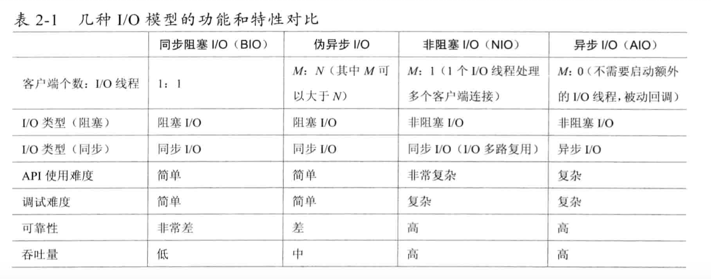

### 四种常见的IO

#### 异步非阻塞IO

NIO支持非阻塞的读和写操作，而且是异步执行的

1. 缓冲区Buffer

缓冲区实质是一个数组，NIO中所有数据的读写都在缓冲区进行处理，最常用的是ByteBuffer

2. 通道Channel
通道可以读取和写入数据，与流不同的是通道是双向的，可以用于读、写或者同时读写

3. 多路复用器Selector

核心是可以通过Selector轮询注册在其上的Channel, 当发现某个或者多个Channel处于就绪状态时，从阻塞状态返回就绪的Channel的选择键集合，进行IO操作

#### BIO服务通信模型

客户端线程和服务端线程1：1，并发性差

代码见[BIO](./src/main/java/bio)

#### 伪异步IO（非官方）

使用线程池维护活跃线程
在通信线程和业务线程之间建立缓冲区，这样业务不会被IO线程所阻塞，消息放入线程池后就返回了，不再直接访问IO线程或者进行IO读写

代码见[伪异步IO](./src/main/java/pseudo)

#### NIO服务端-客户端通信图

服务端

客户端

代码见[NIO](./src/main/java/nio)

#### AIO 

引入新的异步通道的概念，提供异步文件通道和异步套接字通道

代码见[AIO](./src/main/java/aio)

#### 几种不同的IO模型的功能和对比

- BIO，同步阻塞IO，阻塞整个步骤，如果连接少，他的延迟是最低的，因为一个线程只处理一个连接，适用于少连接且延迟低的场景，比如说数据库连接。
- NIO，同步非阻塞IO，阻塞业务处理但不阻塞数据接收，适用于高并发且处理简单的场景，比如聊天软件。
- 多路复用IO，他的两个步骤处理是分开的，也就是说，一个连接可能他的数据接收是线程a完成的，数据处理是线程b完成的，他比BIO能处理更多请求。
- 信号驱动IO，这种IO模型主要用在嵌入式开发，不参与讨论。
- 异步IO，他的数据请求和数据处理都是异步的，数据请求一次返回一次，适用于长连接的业务场景。

